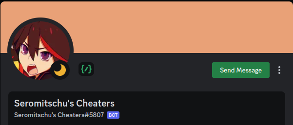
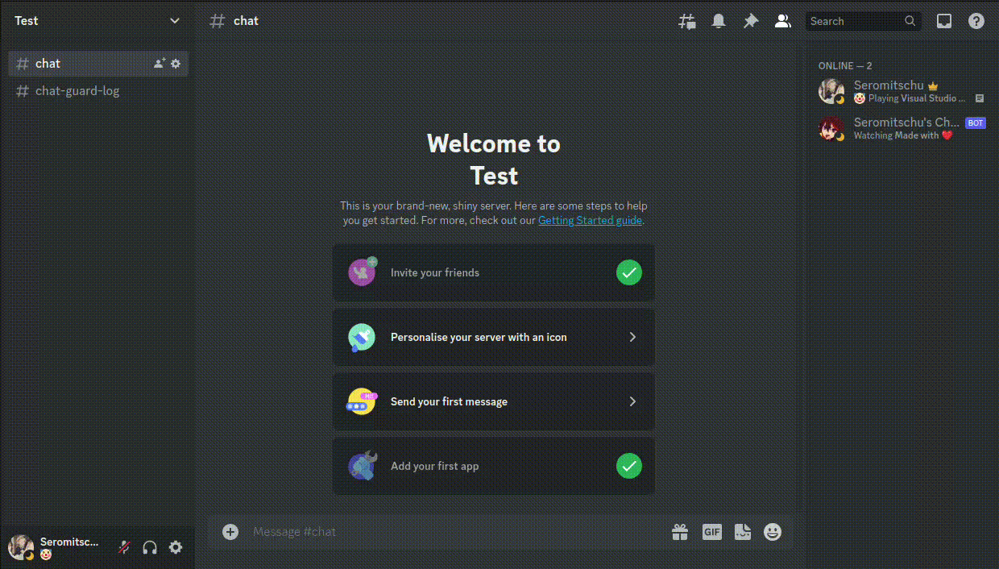
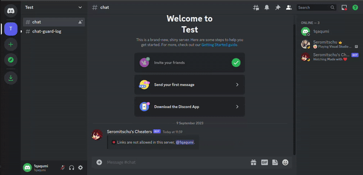

<h1>Seromitschu Discord Chat Guard Bot</h1>


> - This discord bot made by **Seromitschu**. <br>

<h1>Build With</h1>

**This project was built using these technologies.**
<br>
> - JavaScript <br> **Languages ​​were used while making this website.**
> - Visual Studio Code <br>**Code Editor**


<h1>Getting Started</h1>

> - Download project and open in your code editor.
> - Open terminal and type ``npm install``.
> - Go to the ``\Database\Config`` folder and fill in the ``App.json`` and ``Emojis.json`` files in it fill in the information.
```
You can find the emojis in the folder \_ASSETS\Emojis

{
    "APP": {
        "TOKEN": "", /// BOT TOKEN
        "CLIENTID": "", /// BOT ID
        "OWNERID": "" /// BOT OWNER (DEVELOPER) ID
    },

    "ACTIVITY": {
        "TEXT": "", /// BOT STATUS TEXT
        "STATUS": "" /// BOT STATUS (idle, dnd, online, etc.)
    },

    "DATABASE": {
        "URL": "" /// DATABASE URL
    },

    "WEBHOOK": "" /// WEBHOOK FOR ERRORS
}
```
> - The ``ScamLinks.json`` file contains scam links to be blocked.
> - The ``BadWords.json`` file contains swears to be blocked.
> - Then open the terminal again and type ``node .`` or ``node Main.js``.

**Now you can customize and use the bot according to you!**

<h1>Set Up and Protecting</h1>

<h3>Use Command and Set Log Channel and Bypass Permission</h3>

_**Don't forget to give bot admin authorisation! If you do not, the bot cannot detect and delete messages.**_

> After activating the bot, we write ``/setup`` on the server where the bot will be used. Thanks to the slash command, we select the authorisation and log channel that will not be affected by the chat guard. 


<br><br>

<h3>Warning, Notification and Punishment of Violations</h3>

> After installation, protection is provided in 8 areas. Protection types; <br>
-> Caps Lock 
``No more than 50 per cent of the word may contain capital letters.``<br>
-> Character
``You cannot send messages longer than 500 characters.``<br>
-> Link
``You cannot send link.``<br>
-> Mention
``You cannot send more than 3 mentions in 1 message.``<br>
-> Scam Link
``You cannot scam link.``<br>
-> Swear
``You can't swear.``<br>
-> Emote
``You can't use more than 3 emojis in your message.``<br>
-> Spam
``You can't spam.``<br>


<br><br>


<h2>Don't forget to give a ⭐ if you like the project!</h2>
